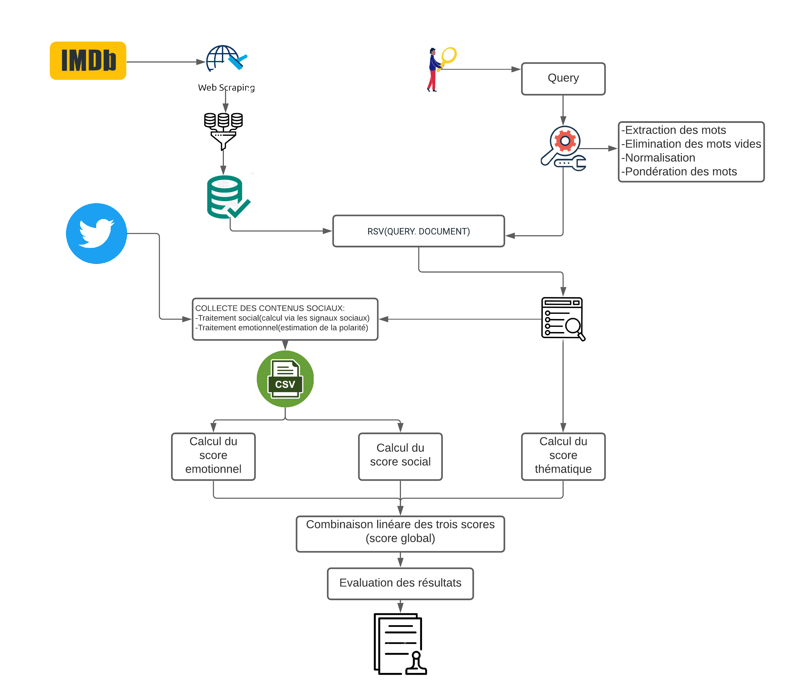

# Impact-des-interactions-sociales-sur-la-recherche-d-information

## RESUME

Le domaine de la recherche d’information (RI) est considéré comme un domaine
d’application réussi du traitement de langage naturel (TLN). De nos jours, l’émergence des
réseaux sociaux a conduit à l’apparition d’une nouvelle branche de recherche d’information, c’est
la recherche d’information sociale qui bénéfice de l’exploitation des informations issus des
interactions user-user et user-ressources Web sur les réseaux sociaux pour améliorer les résultats
de recherche.
Notre travail rentre donc dans la problématique de la RI où nous définissons une approche
basée sur trois mesures de pertinences essentielles pour estimer la pertinence globale des résultats
de recherche : (a) pertinence thématique : traduite le degré d’adéquation de l’information
retrouvée au thème évoqué par les mots clefs de la requête, (b) pertinence sociale : calculée selon
une formule exploitant les signaux sociaux (c) pertinence émotionnelle : calculée selon un
processus d’analyse des sentiments.
Nos expériences montrent une amélioration significative de la performance du système de
la recherche classique de films en intégrant des critères sociaux et émotionnels provenant des
réseaux sociaux. Cette exploitation est réalisée selon des mesures définies dans le domaine de la
RI et en utilisant un dataset de films définis et construit à partir du site IMDb.
Mots-clés : recherche d’information, traitement de langage naturel, recherche d’information
sociale, pertinence, signaux sociaux, processus d’analyse des sentiments, système de recherche
d’information, dataset.

## Architecture générale de notre système

Cette section est consacrée à la description du processus général de la méthodologie de
Ranking thématique et re-ranking Socio-Emotionnel des résultats de recherche en exploitant les
contenus sociaux du big-social data "Twitter".
Notre processus de RI, qui est la procédure fondamentale du système, a pour but la mise en
relation des informations disponibles (dataset IMDb) d’une part, et les besoins de l’utilisateur
(Query) d’autre part.
Ce processus de recherche peut se résumer dans la Error! Reference source not found.5 cidessous :
some L’indexation des documents (Document) et des requêtes (Query).
some L’appariement (Document, Query), qui permet de comparer la requête et le document.
L’utilisateur exprime son besoin en information par une requête (Query) et interroge la base
des films (Document) brute d'une part et augmentée de données sociales d'autres part, via une
interface qui assure la communication entre la base des films et l’utilisateur. Ces données sociales
représentent ainsi une valeur ajoutée (des méta-données), pour enrichir le contenu et la
représentation des documents originaux.
Notre SRI est constitué de Module de traitement des documents pour l’indexation et le
stockage d’information, Module de traitement des requêtes qui a pour objectif de représenter les
requêtes des utilisateurs et Module de recherche d'information en effectuant une correspondance
RSV (Document, Query) entre requête utilisateur et documents de la base. A l’étape final, le
système renvoi l’information pertinente via un outil de visualisation.
Le processus de RI que nous proposons consiste à estimer l’importance Socio-EmotThématique d’une ressource en exploitant ses signaux sociaux associés et quantifiés, où chaque
contenu social textuel représente un facteur de pertinence.

### Les étapes

1. Collecte des documents de films d’IMDB
2. Prétraitement (Preprocessing)
3. Indexation
4. Appariement document-requête
5. Collecte des contenus sociaux via Twitter
6. Evaluation des résultats

## Architecture générale de notre SRI

